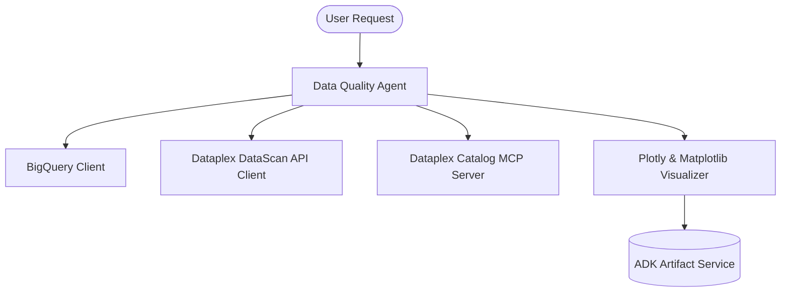

# Data Quality Agent (Python ADK)

A specialized agent developed using the **Google Python Agent Development Kit (Python ADK)** that specializes in the analysis of data quality issues, discovery of data profiling information, and creation, editing, and removing of **Google Cloud Dataplex** data quality rules.

This agent assists data engineers, analysts, and stewards in maintaining high-quality datasets by discovering profiling metadata in Dataplex Knowledge Catalog, querying data directly in **BigQuery** for anomaly and null detection, and taking automated or guided remediation actions.

---

## 🏗️ Architecture



### Key Capabilities
1. **Dataplex Universal Catalog Lookups (MCP)**: Searches and inspects schemas, descriptions, and metadata of datasets and tables in the Knowledge Catalog.
2. **Data Profiling Analysis**: Accesses Dataplex profiling job results to understand column cardinality, data distributions, and null ratios.
3. **Data Quality Score Auditing**: Retrieves overall scores, dimensions (Completeness, Validity, etc.), and rule-level pass/fail details from existing Dataplex scans.
4. **Direct SQL Verification**: Formulates and runs BigQuery SQL queries to scan tables for null values, duplicates, and business logic violations in real-time.
5. **Interactive Visualization**: Formulates and executes Plotly or Matplotlib code to render visual charts of data quality and null distributions.
6. **Remediation & Rule Management**: Safely creates or updates Dataplex data quality rules and template libraries, always verifying existing rules first and requesting explicit user permission before taking action.

---

## ⚙️ Configuration Parameters

Configuration is managed via environment variables. Copy `.env.example` to `.env` and fill in the values:

```env
# Gemini model used to power the agent (Recommended: gemini-2.5-flash or gemini-2.5-pro)
AGENT_MODEL="gemini-2.5-flash"

# Google Cloud project ID containing BigQuery datasets and Dataplex assets
GOOGLE_CLOUD_PROJECT="your-gcp-project-id"

# Google Cloud region where Dataplex is configured (Default: us-central1)
DATAPLEX_REGION="us-central1"
```

---

## 📂 Directory Structure

```
data-quality-agent/
├── data_quality_agent/
│   ├── __init__.py           # Package initializer exposing root_agent
│   ├── agent.py              # Main Agent and MCP setup definition
│   ├── prompt.py             # Detailed system prompt for Data Quality Agent
│   ├── tools.py              # BQ, Plotly, and Dataplex DataScan API tools
│   ├── mcp_config.py         # MCP server connection parameters
│   └── plugins.py            # Custom ADK plugins (Reflect & Retry)
├── docs/
│   ├── analysis_task.md      # Detailed walkthrough of the data quality analysis task
│   └── remediation_task.md   # Detailed walkthrough of the rule remediation task
├── tests/
│   └── test_data_quality_agent.py # Unit tests for the agent and tools
├── .env.example              # Example environment configuration
├── .env                      # Local configuration file (ignored by git)
├── pyproject.toml            # Poetry/Hatch dependencies and package metadata
├── run_local.py              # Interactive console test client
└── README.md                 # Project documentation
```

---

## 🚀 Getting Started

### 1. Installation
Navigate to the project directory and install dependencies:

```bash
# Using uv (highly recommended)
uv sync --dev

# Or using poetry
poetry install
```

### 2. Running the Agent (Interactive Console CLI)
You can run the interactive `run_local.py` script to speak with the agent:

```bash
# Using uv
uv run python run_local.py

# Using poetry
poetry run python run_local.py
```

### 3. Running Unit Tests
Validate that all tools and agent components work correctly:

```bash
# Using uv
PYTHONPATH=. uv run pytest tests/test_data_quality_agent.py

# Using poetry
PYTHONPATH=. poetry run pytest tests/test_data_quality_agent.py
```

### 4. Running via ADK Dev UI
You can run the agent inside the ADK Web UI:

```bash
adk web .
```
Then select `data_quality_agent` from the dropdown.

---

## 🛡️ GCP IAM Permissions
To deploy and run the agent in your GCP environment, ensure the runner or Cloud Run service account has the following IAM roles:

*   **BigQuery Job User** (`roles/bigquery.jobUser`): To run SQL queries.
*   **BigQuery Data Viewer** (`roles/bigquery.dataViewer`): To read table schemas and rows.
*   **Dataplex Developer** (`roles/dataplex.developer`): To create, update, and retrieve data quality scans and rules.
*   **Dataplex Viewer** (`roles/dataplex.viewer`): To view catalog entries and profiling results.
*   **Vertex AI User** (`roles/aiplatform.user`): To call the Gemini model.
*   **Service Account User** (`roles/iam.serviceAccountUser`): Required for running and deploying.