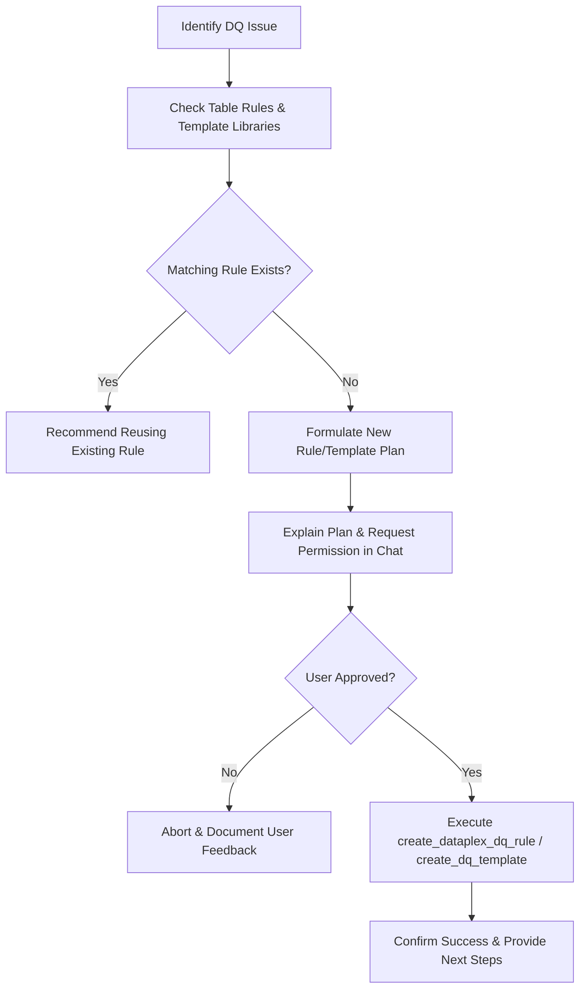

# Task 2: Data Quality Remediation and Rule Management

This document describes how the **Data Quality Agent** executes remediation actions to improve data quality. It outlines the specific mechanisms the agent uses to create data quality rules, manage template libraries, perform multi-table checks, and enforce user authorization.

---

## 📋 Task Overview

When data quality analysis (Task 1) reveals issues—such as columns containing unexpected nulls, data types out of range, or failing scan scores—the agent is designed to take corrective action. Remediation involves:
1. **Defining specific data quality rules** on target columns to prevent and detect bad data.
2. **Developing reusable templates** inside template libraries for multi-table data reconciliation.
3. **Checking existing rules and libraries** to avoid duplicate or conflicting rules.
4. **Asking for explicit user permission** before modifying any GCP resource.

---

## 🛡️ Guiding Principles for Remediation

The agent operates under two strict, non-negotiable architectural principles:

### 1. Pre-Remediation Verification (Check First)
The agent will **never** create a rule blindly. It must first inspect what is already defined:
*   It calls `get_data_quality_scan_results` to see what rules are currently active on the target table.
*   It calls `list_dq_templates` to see if a suitable rule template already exists in the project's libraries.
*   If a rule is already present in a library or defined on the table, the agent will recommend reuse rather than recreation.

### 2. Double-Opt-In Permission (User in Control)
The agent is designed to be collaborative and safe. It **cannot** modify rules autonomously:
*   Before calling `create_dataplex_dq_rule` or `create_dq_template`, it must lay out the proposed rule clearly in the chat.
*   It explains:
    *   Which table and column are targeted.
    *   What type of rule is being created (e.g., NonNullExpectation).
    *   Why it is recommended (citing the null counts/percentages discovered during analysis).
*   It must wait for the user to explicitly say "Yes", "Approve", or "Go ahead" in the chat before executing the tool.

---

## 🛠️ Remediation Tools

The agent utilizes dedicated write tools to perform GCP Dataplex rule management:
*   `create_dataplex_dq_rule`: Adds or updates a rule on a table's DataScan spec. Supports:
    *   `NonNullExpectation`: Ensures a column contains zero nulls.
    *   `RangeExpectation`: Validates numeric values fall between a specified min and max.
    *   `RegexExpectation`: Verifies string formats (e.g., emails, phone numbers).
    *   `RowConditionExpectation`: Custom SQL expression checks (e.g., `sale_price >= cost`).
*   `create_dq_template`: Adds a reusable rule template to a shared library for multi-table checks.

---

## 📋 Step-by-Step Remediation Protocol

When the agent detects a data quality issue (e.g., nulls in `customer_id` or mismatched record counts), it executes the following protocol:

### Phase 1: Verification
1. The agent checks if a rule already exists for the column by calling `get_data_quality_scan_results`.
2. It lists available rule template libraries via `list_dq_templates`.

### Phase 2: Design & Propose
1. The agent designs the rule spec. For example:
   *   *Issue*: `customer_email` has a 5% null rate.
   *   *Proposed Rule*: `NonNullExpectation` on `customer_email`, categorized under the `COMPLETENESS` dimension.
2. The agent presents this proposal to the user in the chat with a clear call-to-action requesting approval.

### Phase 3: Gated Execution
1. Upon receiving user confirmation, the agent invokes `create_dataplex_dq_rule` (or `create_dq_template` if it's a multi-table template rule).
2. The tool interacts with the GCP Dataplex API:
    *   If a DataScan already exists for the table, it appends the new rule to the spec and updates it.
    *   If no DataScan exists, it creates a new scan, attaches the rule, and starts the scan.
3. The agent reports the success of the operation, including the resource names of the updated scans.

---

## 💬 Example Remediation Conversation

> **User**: *Analyze the data quality of our orders table.*
>
> **Agent**: *Analyzing `project.dataset.orders`... I found that the `order_status` column has 120 null values (representing 2.4% of the rows). There is currently no rule defined to prevent nulls in this column.
> I checked our template libraries and found a standard Completeness library that includes a `NonNullExpectation` template.*
>
> **Agent**: *I recommend creating a new `NonNullExpectation` rule on the `order_status` column to ensure completeness.
> **Would you like me to go ahead and create this rule in Dataplex for you?***
>
> **User**: *Yes, please do.*
>
> **Agent**: *Calling `create_dataplex_dq_rule`...*
> *Success! I have added the NonNullExpectation rule on column `order_status` for table `project.dataset.orders` in Dataplex. You can now run the scan to verify future data.*
