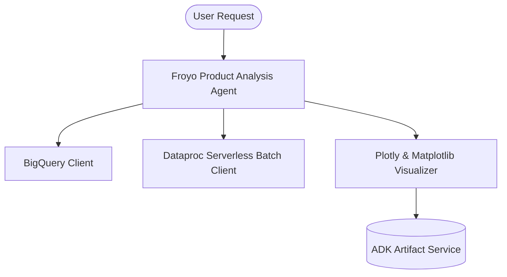

# Froyo Product Analysis Agent (ADK)

A specialized agent developed using the **Google Python Agent Development Kit (Python ADK)** to serve as a Product Analysis Assistant for **Froyo**, a premium frozen yogurt brand.  

This agent assists analysts in understanding ingredients and product analysis by querying data in **BigQuery**, launching batch analytics jobs on **Dataproc (Spark)**, and rendering interactive performance charts via **Plotly**

---

## 🏗️ Architecture



### Key Components
1. **BigQuery Integration**: Formulates and executes SQL queries against product, transaction sales, and ingredient/recipe tables.
2. **Dataproc Serverless Spark Notebook Executor**: Runs PySpark notebooks on serverless Dataproc sessions (using the Iceberg federation template kernel) to perform federated joins and data science analysis.
3. **Interactive Plotly Visualizer**: Compiles and executes Plotly chart logic, exporting charts as rich HTML artifacts.
4. **Dataplex MCP Server**: Queries Dataplex (Knowledge Catalog) for metadata about tables and datasets. Can discover rich metadata to help discover tables, find schemas, and get additional metadata to answer questions

## ⚙️ Configuration Parameters
Configuration is managed via environment variables. Copy `.env.example` to `.env` and fill in the values:

```env
# Gemini model used to power the analysis agent
# Recommended: gemini-2.5-flash or gemini-2.5-pro
AGENT_MODEL="gemini-2.5-flash"

# Google Cloud project ID containing your BigQuery datasets and Dataproc clusters
GOOGLE_CLOUD_PROJECT="cloud-summit-data-analytics"

# Google Cloud region where your Dataproc cluster is hosted
DATAPROC_REGION="us-central1"

# Cloud Storage bucket for saving PySpark script scripts and outputs
GCS_BUCKET_FOR_SPARK="froyo-analytics-lake"
```

## Execution & Data Processing Rules
- **CRITICAL RULE - Structured Specs**: Semantic and structured information extracted from the PDFs is available in a BigQuery dataset named `cloud_summits_pdfs`
- **CRITICAL RULE - Product and Receipt data**: Data about products and their recipes and ingredients has been extracted from PDFs and are stored in views in BigQuery dataset `cloud_summit_pdfs`. When referencing this dataset, ensure you are always using it with the project ID (`cloud-summit-data-analytics`)
- **CRITICAL RULE - Customer and Order Data**: Froyo customer data and orders are in the Lakehouse / BigLake dataset `cloud-summit-2026-lakehouse.acai_dataset`. When referencing this dataset, ensure you are always using it with the project ID (`cloud-summit-data-analytics`) and namespace prefix `acai_dataset`. For example, to query the order table in this dataset you should use `cloud-summit-data-analytics.acai_dataset.cloud_summit_pdfs.orders`.
- **CRITICAL RULE - Data Joins between BigQuery dataset and Iceberg dataset**: ANY task requiring a join or integration between the BigQuery datasets `cloud_summit_pdfs` of the PDF data and the `ccloud-summit-2026-lakehouse.acai_dataset` of the customer data MUST be executed using **Spark Notebooks**.
- **CRITICAL RULE - Notebook Kernel**: Every Spark notebook utilized MUST exclusively be configured to run on the Serverless Session template `iceberg-federation-template` as its kernel.
- **CRITICAL RULE - Data Science**: ANY data science, machine learning, or advanced analytical task MUST be performed strictly within **Spark Notebooks** using the aforementioned setup.

---

## 📂 Directory Structure

```
froyo-product-analysis/
├── froyo_product_analysis/
│   ├── __init__.py           # Package initializer exposing root_agent
│   ├── agent.py              # Main Agent and MCP setup definition
│   ├── prompt.py             # Instructions and guidelines for the Froyo agent
│   └── tools.py              # BQ, Dataproc, and Plotly visualization tools
├── tests/
│   └── test_froyo_agent.py   # Unit tests for the agent and tools
├── .env.example              # Example environment configuration
├── .env                      # Local configuration file (ignored by git)
├── pyproject.toml            # Poetry/Hatch dependencies and package metadata
├── run_local.py              # Interactive console test client
└── README.md                 # Project documentation
```

---

## 🚀 Getting Started

### 1. Installation
Navigate to the directory and install dependencies:

```bash
cd python/agents/froyo-product-analysis

# Using uv (highly recommended)
uv sync --dev

# Or using poetry
poetry install
```

### 2. Running the Agent (Interactive Console CLI)
You can run the interactive `run_local.py` script to talk to the agent:

```bash
# Using uv
uv run python run_local.py

# Using poetry
poetry run python run_local.py
```

### 3. Running Unit Tests
Validate that all tools and agent components work correctly:

```bash
# Using uv
uv run pytest tests/test_froyo_agent.py

# Using poetry
poetry run pytest tests/test_froyo_agent.py
```

### 4. Running via ADK Dev UI
You can run the agent inside the ADK Web UI:

```bash
adk web .
```
Then select `froyo_product_analysis_agent` from the dropdown.

### 5. Deploying to Google Cloud Run

To containerize and deploy the agent to Google Cloud Run:

1. **Build and publish the container image to Artifact Registry**:
   ```bash
   gcloud builds submit --tag gcr.io/YOUR_PROJECT_ID/froyo-product-analysis
   ```

2. **Deploy to Cloud Run**:
   ```bash
   gcloud run deploy froyo-product-analysis \
     --image gcr.io/YOUR_PROJECT_ID/froyo-product-analysis \
     --platform managed \
     --region us-central1 \
     --allow-unauthenticated \
     --set-env-vars="AGENT_MODEL=gemini-2.5-flash,GOOGLE_CLOUD_PROJECT=YOUR_PROJECT_ID,DATAPROC_REGION=us-central1,GCS_BUCKET_FOR_SPARK=YOUR_BUCKET_NAME"
   ```

   or

   ```
   uvx --from google-adk>=2.0.0 adk deploy cloud_run --project=cloud-summit-data-analytics --region=us-central1 --service_name=froyo-agent --with_ui ./froyo_product_analysis -- --service-account=
   ```

   Need to grant service account for MCP server
   gcloud projects add-iam-policy-binding <projectID> \
    --member="serviceAccount:XXXXX-compute@developer.gserviceaccount.com" \
    --role="roles/agentregistry.viewer"

gcloud projects add-iam-policy-binding cloud-summit-data-analytics \
    --member="serviceAccount:XXXX-compute@developer.gserviceaccount.com" \
    --role="roles/aiplatform.user"

gcloud projects add-iam-policy-binding cloud-summit-data-analytics \
    --member="serviceAccount:XXX-compute@developer.gserviceaccount.com" \
    --role="roles/bigquery.jobUser"

gcloud projects add-iam-policy-binding cloud-summit-data-analytics \
    --member="serviceAccount:XXX-compute@developer.gserviceaccount.com" \
    --role="roles/dataproc.serverless.editor"

gcloud projects add-iam-policy-binding cloud-summit-data-analytics \
    --member="serviceAccount:XXX-compute@developer.gserviceaccount.com" \
    --role="roles/dataproc.editor"

gcloud projects add-iam-policy-binding cloud-summit-data-analytics \
    --member="serviceAccount:XXX-compute@developer.gserviceaccount.com" \
    --role="roles/iam.serviceAccountUser"

gcloud iam service-accounts add-iam-policy-binding \
    769357427691-compute@developer.gserviceaccount.com \
    --member="user:admin@danielholgate.altostrat.com" \
    --role="roles/iam.serviceAccountUser"

gcloud projects add-iam-policy-binding cloud-summit-data-analytics \
    --member="serviceAccount:XXX-compute@developer.gserviceaccount.com" \
    --role="roles/biglake.viewer"  

MCP Server
gcloud beta services enable dataplex.googleapis.com