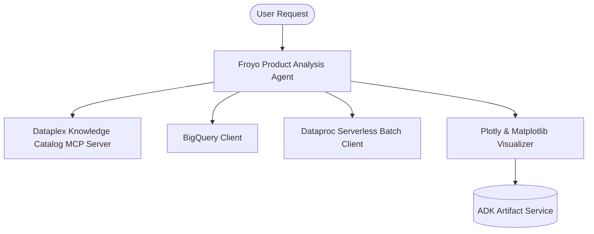

# Froyo Product Analysis Agent (ADK)

A specialized agent developed using the **Google Python Agent Development Kit (Python ADK)** to serve as a Product Analysis Assistant for **Froyo**, a premium frozen yogurt brand. The agent 

This agent assists analysts in understanding ingredients and product analysis using a **Dataplex (Knowledge Catalog) MCP Server**, querying transaction records via **BigQuery**, launching batch analytics jobs on **Dataproc (Spark)**, and rendering interactive performance charts via **Plotly**. 

---

## 🏗️ Architecture



### Key Components
1. **Dataplex (Knowledge Catalog) MCP Server**: Uses the Model Context Protocol (MCP) stdio connection to dynamically discover data catalog schemas, assets, business glossary terms, and lineage records.
2. **BigQuery Integration**: Formulates and executes SQL queries against product, transaction sales, and ingredient/recipe tables.
3. **Dataproc Serverless Spark Notebook Executor**: Runs PySpark notebooks on serverless Dataproc sessions (using the Iceberg federation template kernel) to perform federated joins and data science analysis.
4. **Interactive Plotly Visualizer**: Compiles and executes Plotly chart logic, exporting charts as rich HTML artifacts.

## ⚙️ Configuration Parameters
Configuration is managed via environment variables. Copy `.env.example` to `.env` and fill in the values:

```env
# Gemini model used to power the analysis agent
# Recommended: gemini-2.5-flash or gemini-2.5-pro
AGENT_MODEL="gemini-2.5-flash"

# Google Cloud project ID containing your BigQuery datasets and Dataproc clusters
GOOGLE_CLOUD_PROJECT="froyo-analytics-prod"

# Google Cloud region where your Dataproc cluster is hosted
DATAPROC_REGION="us-central1"

# Cloud Storage bucket for saving PySpark script scripts and outputs
GCS_BUCKET_FOR_SPARK="froyo-analytics-lake"
```

## Execution & Data Processing Rules
- **CRITICAL RULE - Structured Specs**: The semantic and structured information extracted from the PDFs is available in a BigQuery dataset named `cloud_summits_pdfs` (referred to as the Knowledge Catalog).
- **CRITICAL RULE - Customer Data**: Existing Froyo customer data resides in BigQuery in the dataset `cloud_summit_pdfs`. When you are referencing a dataset, ensure you are using it with the project ID (`cloud-summit-data-analytics`) and namespace prefix `acai_dataset`. For example, to query order table in this dataset you should use `cloud-summit-data-analytics.acai_dataset.cloud_summit_pdfs.orders`.
- **CRITICAL RULE - Data Joins between BigQuery dataset and Iceberg dataset**: ANY task requiring a join or integration between the BigQuery datasets `cloud_summit_pdfs` of the PDF data and the `cloud_summit_pdfs` of the customer data MUST be executed using **Spark Notebooks**.
- **CRITICAL RULE - Notebook Kernel**: Every Spark notebook utilized MUST exclusively be configured to run on the Serverless Session template `iceberg-federation-template` as its kernel.
- **CRITICAL RULE - Data Science**: ANY data science, machine learning, or advanced analytical task MUST be performed strictly within **Spark Notebooks** using the aforementioned setup.

---

## 📂 Directory Structure

```
froyo-product-analysis/
├── froyo_product_analysis/
│   ├── __init__.py           # Package initializer exposing root_agent
│   ├── agent.py              # Main Agent and MCP setup definition
│   ├── prompt.py             # Instructions and guidelines for the Froyo agent
│   └── tools.py              # BQ, Dataproc, and Plotly visualization tools
├── tests/
│   └── test_froyo_agent.py   # Unit tests for the agent and tools
├── .env.example              # Example environment configuration
├── .env                      # Local configuration file (ignored by git)
├── pyproject.toml            # Poetry/Hatch dependencies and package metadata
├── run_local.py              # Interactive console test client
└── README.md                 # Project documentation
```

---

## 🚀 Getting Started

### 1. Installation
Navigate to the directory and install dependencies:

```bash
cd python/agents/froyo-product-analysis

# Using uv (highly recommended)
uv sync --dev

# Or using poetry
poetry install
```

### 2. Running the Agent (Interactive Console CLI)
You can run the interactive `run_local.py` script to talk to the agent:

```bash
# Using uv
uv run python run_local.py

# Using poetry
poetry run python run_local.py
```

#### Example Conversation
```
You: List the assets in the catalog and check how the sales table relates to the ingredients catalog.

[froyo_product_analysis_agent Calling Tool]: list_catalog_assets( {} )
...
[froyo_product_analysis_agent]: Based on the Froyo Knowledge Catalog:
1. `froyo_sales_bq` (BigQuery sales fact table) joins with `froyo_products_bq` (Product dimension).
2. `froyo_products_bq` has a recipe composition relationship with `froyo_ingredients_bq`.
Therefore, the sales table maps to ingredients through the product dimension table.
```

### 3. Running Unit Tests
Validate that all tools and agent components work correctly:

```bash
# Using uv
uv run pytest tests/test_froyo_agent.py

# Using poetry
poetry run pytest tests/test_froyo_agent.py
```

### 4. Running via ADK Dev UI
You can run the agent inside the ADK Web UI:

```bash
adk web .
```
Then select `froyo_product_analysis_agent` from the dropdown.
